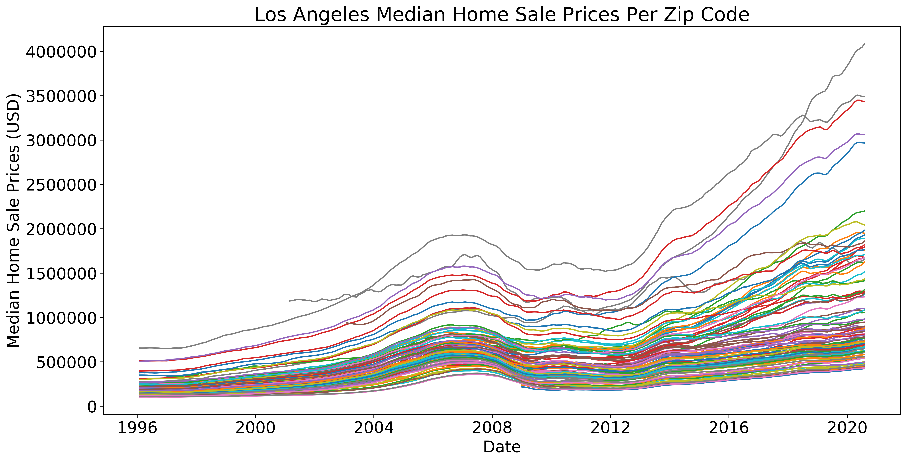
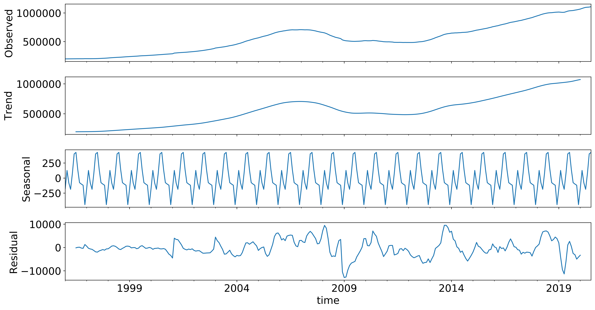
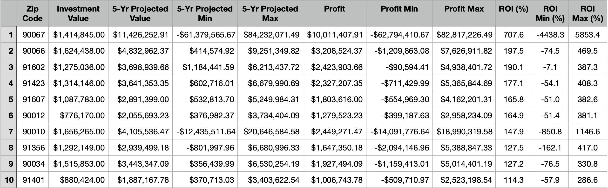
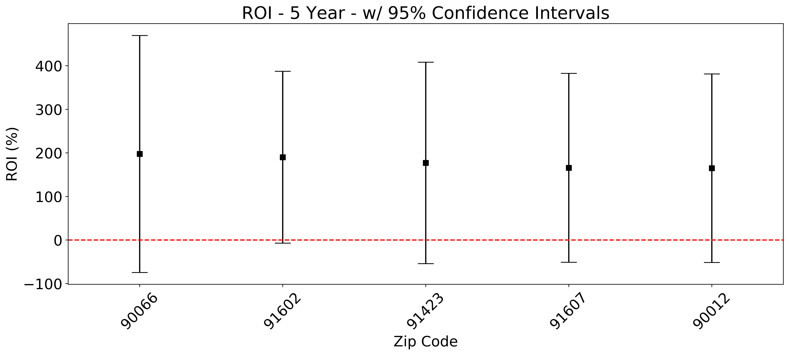
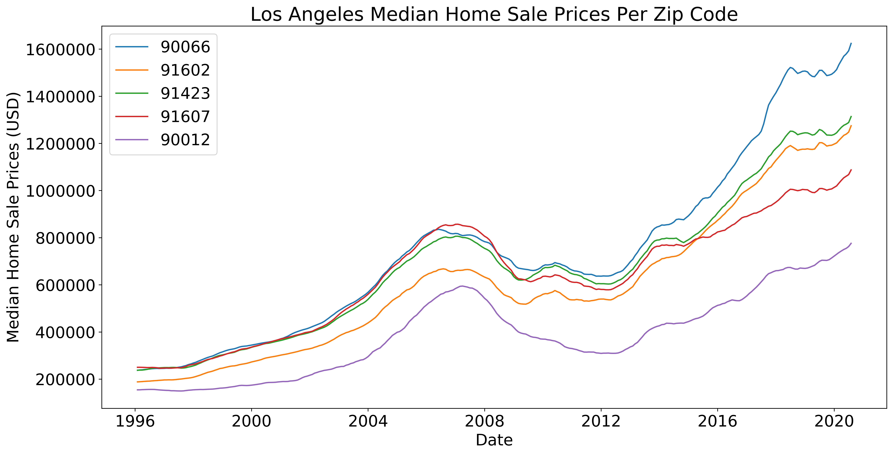

# Time-Series-Modeling
**A SARIMAX time series model analysis to discover the top 5 best zip codes of Los Angeles, California to invest in.**

### Author: Jessica Forrest-Baldini

## Business Case

A real estate investment group is looking to invest in single family homes in Los Angeles and wants to know the top 5 best zip codes to invest in for the greatest ROI (return on investment) with the least amount of risk.

The strategy is buy and hold, so we will be looking at 5 year projections. And for further work we recommend analyzing the rental markets for the top 10 zip codes for comparison. 

## Data

From Zillow:
https://www.zillow.com/research/data/

Zip_zhvi_uc_sfr_tier_0.33_0.67_sm_sa_mon.csv

Filename changed to: up_to_date_zillow_data.csv in this repository

## Contents 

- figures - Figures folder
- .gitignore - Git ignore file
- README.md - Readme file
- los_angeles_real_estate_notebook.ipynb - Notebook
- up_to_date_zillow_data.csv - Data

## Methods 

**Data**

The data used were for single family homes on Zillow from 1/31/1996 through 7/31/2020 (the most current data available at the time of this project).

These were median home values for the 33rd - 67th percentile of each zip code. There were 100 total zip codes for the greater metropolitan region of Los Angeles, California.

**Model & Seasonality**

The data were seasonaly smoothed by Zillow, however upon decomposition, seasonality was discovered, so a SARIMAX model was used to account for seasonality in our time series model.

Seasonal Decomposition:

**Parameter Selection**

A gridsearch was conducted to find the optimal parameter values for the SARIMAX model. I averaged all Los Angeles zip codes and optimized parameters by lowest BIC. However, when I then applied this model to zip codes individually, the forecasted home values were off the charts high with very large confidence intervals. 

I then ran a gridsearch for one zip code, West Hollywood and applied the model with those optimized parameters to all 100 zip codes, also considering RMSE (if RMSE was lower for a slightly higher BIC, then the lower RMSE set of parameters would be used). This yielded clear results with a clear trend and projections that had much smaller confidence intervals than the all-of-LA-averaged model. 

**Forecasting**

We used dynamic forecasting and projected median home sale values for each zip code 5 years into the future and based the current median home sale value as the investment value. With the investment value and the 5-year projected value we calculated ROI (return on investment) as:

profit/investment * 100 -which equated to- (forecasted value - current value)/investment value * 100 

**Top 5 Zip Code Selection**

We looked at the top 10 zip codes selecting for highest ROI, while also taking into account confidence intervals or uncertainty. The top projected zip code was removed due to its confidence intervals being so uncertain (large). The next 5 zip codes offered the highest ROI while having much smaller confidence intervals, with the following zip code having much larger confidence intervals. Therefore, we selected #2-6 ranked by ROI as the top 5.

## Results

### Top 10 Zip Codes & Metrics  

### Top 5 Zip Codes

Ranked #2-6 by highest ROI and selected for by lowest uncertainty (smallest confidence intervals).

- 90066: Mar Vista (bordering Playa Vista and Marina Del Rey)
- 91602: Toluca Lake and parts of Studio City (smallest confidence intervals - safest investment)
- 91423: Sherman Oaks
- 91607: Valley Village
- 90012: Chinatown/Downtown Los Angeles (slightly lower prices than the top 5)

Here are the projected 5 year returns on investment for our top 5 zip codes with 95% confidence intervals:

And here are the historic median home sale values for our top 5 selected zip codes:

The dynamic projection figures for our top 5 zip codes can be found in our project notebook: https://github.com/JessicaFB/Time-Series-Modeling/blob/master/los_angeles_real_estate_notebook.ipynb under "**6.6  Models & 5 Year Dynamic Forecast for Top 5 Zip Codes**".

## Recommendations 

**Top 5 Zip Codes**

Based off of our projections and analysis, I recommend investing in zip codes 2-6, discussed above:

- 90066: Mar Vista (bordering Playa Vista and Marina Del Rey)
- 91602: Toluca Lake and parts of Studio City (2nd highest return & lowest relative risk)
- 91423: Sherman Oaks
- 91607: Valley Village
- 90012: Chinatown/Downtown Los Angeles

These offer the highest returns of all zip codes at around 165-200% return on investment (ROI) and have the least amount of variation among the top 9 zip codes. Mar Vista (90066) has slightly higher variation than the number 10 ranked zip code, but also with higher ROI.

**Predicted Housing Bubble**

I recommend waiting to see if the housing market crashes post-pandemic or at least post-second stimulus package. If the rental market is predicted to be strong, I recommend investing in the above neighborhoods when market values are low or stable, depending on what happens in the coming months and into 2021.

**Century City**

Century City is more uncertain due to market volatility, however the homes for sale are the same price range and style as the rest of the markets, so I would recommend doing more research on Century City before deciding to invest there. A new Westfield mall was built there, it has a nice wework and is considered up and coming, so the opportunity could be large. That being said, the risk could be larger as well.

**Strong Rental Markets**

If looking to invest now, and take advantage of low mortgage rates, again, I recommend investing where the rental markets are strong and least likely to be affected by a pandemic-related housing bubble or possible recession. Since Los Angeles is affected by shut downs to the entertainment industry as well as tourism and the restaurant, nightlife and retail industries, it is best again to either wait and see, or invest in zip codes where rental markets are expected to remain strong.

This leads us into our future work recommendations.

## Future Work

**Rental Markets**

Zillow also has rental market data. For future work I recommend analyzing the rental market and comparing it to our top zip codes from our analysis, so we can determine which zip codes would have higher rent-to-mortgage ratios. This would also help us further determine the best zip codes to invest in, the best to protect against a possible housing bubble and/or recession, and the overall maximum return on investment.

## Thank you!

For any additional questions, please feel free to connect with me at jlforrestbaldini@gmail.com or on LinkedIn at https://www.linkedin.com/in/jessica-forrest-baldini-0468111a4/
